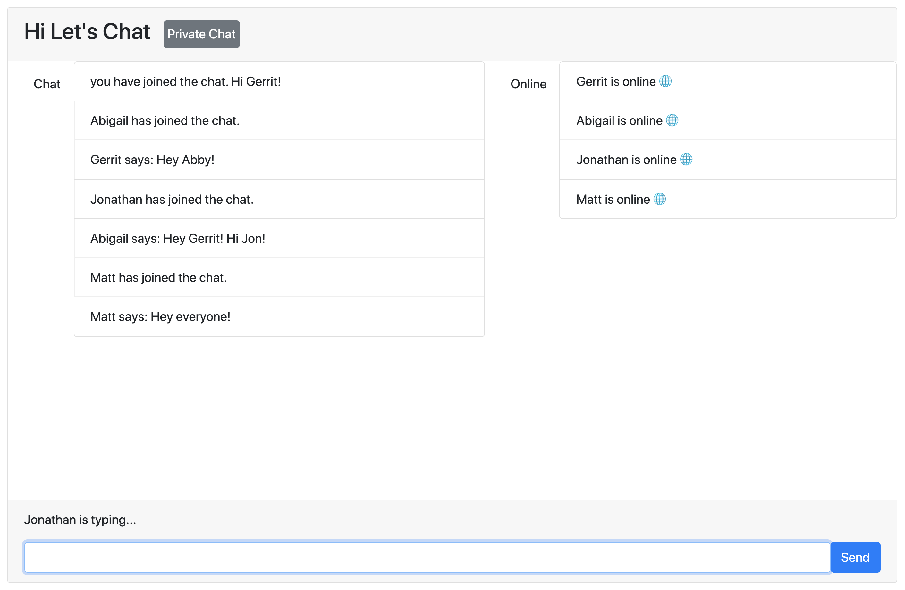

# Hi Let's Chat

## Contents
- [What It Is](#What-It-Is)
- [What I Used](#What-I-Used)
- [Challenges and Solutions](#Challenges-and-Solutions)
- [Minimum Viable Product](#Minimum-Viable-Product)
- [Stretch Goals](#Stretch-Goals)
- [Screenshots](#Screenshots)
- [Code Examples](#Code-Examples)
## What It Is
Hi Let’s Chat is a full-stack app that uses web sockets to pass data between the client-side and server-side. The app includes
features such as the ability to detect what users are online, when a user is typing, and private chat. 

I used Node.js and Express to handle the routing for this app and the Socket.IO library to implement web sockets. I also used the Embedded JavaScript view engine to render HTML templates.
## What I Used
- JavaScript
- jQuery
- Node.js
- Express
- Embedded JavaScript view engine
- Socket.IO
## Challenges and Solutions
- Challenge #1: Learning to use the Socket.IO library

- Challenge #2: Working with HTML Templating and the EJS View Engine

- Challenge #3: Building the functionality for Private Chat

## Minimum Viable Product
## Stretch Goals
## Screenshots
## Code Examples
